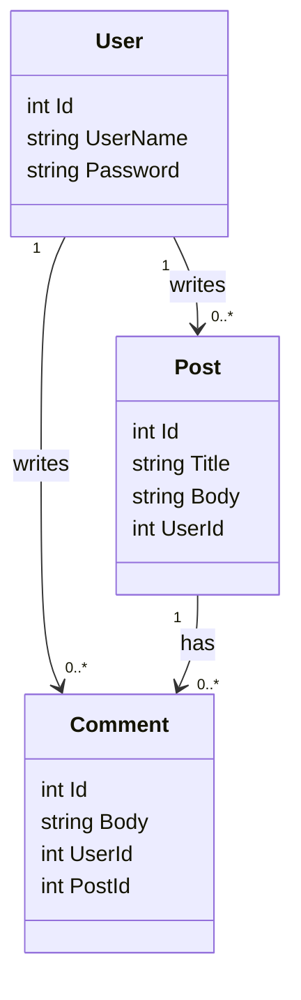

# Domain model

Relationships are implemented with the `UserId` and `PostId` foreign-key
properties. The entity classes intentionally contain no association or
collection properties in Parts 1 and 2.
